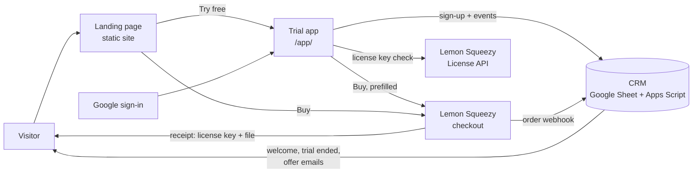

# Big Countdown: launch plan and architecture

## 1. Architecture

No servers to run. Every part is a hosted service with a free tier, connected by one settings
file (`landing/config.js`).

| Part | Service | Why |
|---|---|---|
| Website and trial | Netlify or Cloudflare Pages (static) | Free, HTTPS, deploy by drag-and-drop |
| Payments, tax, invoices, refunds | Lemon Squeezy (merchant of record) | Handles VAT/sales tax worldwide, so you don't need to |
| License keys and file delivery | Lemon Squeezy | Built-in keys with device limits, re-download page for buyers |
| CRM and follow-up emails | Google Sheet + Apps Script (`crm/`) | Free; upgrade to Brevo/HubSpot later without code changes |
| One-click sign-up | Google Identity Services | Verified email, no password |
| Analytics | Plausible (optional) | Cookie-free, so no cookie banner needed |

### How a customer moves through it

1. **Landing page**: reads, tries the mini timer, clicks *Try free*.
2. **Sign-up** in the trial: Google or name/surname/email. No account or password.
   Optional newsletter tick box. Terms and Privacy linked.
3. **Trial**: 5 minutes of countdown. CRM gets `signup`, `trial_started`; welcome email goes out.
4. **Paywall** after 5 minutes: *Buy* (checkout prefilled with their name and email),
   *I already bought: enter my key*, or *Email me this offer*. CRM gets `trial_ended`;
   the trial-ended email goes out.
5. **Purchase** on Lemon Squeezy: receipt with **license key** and **file download**.
   Webhook marks them `customer` in the CRM; thank-you email goes out.
6. **Using it**: paste the key in the web version (any browser, always the latest version),
   or open the file offline. *Have a key?* links on the landing page and sign-up screen.
7. **Lost key or file**: Lemon Squeezy's *My orders* page, linked from the FAQ, the
   paywall and the unlock screen.

## 2. Gaps and fixes, by priority

Status: ✅ built in code · 🔧 needs your account or input · ⏭ phase 2

### P0: needed to sell

| # | Gap | Fix | Status |
|---|---|---|---|
| 1 | Buy button goes nowhere | Lemon Squeezy checkout link in `config.js`; prefilled with the trial user's name and email | ✅ + 🔧 |
| 2 | Leads stay in the browser | Every sign-up and step is sent to the CRM endpoint, with a retry queue if offline | ✅ + 🔧 |
| 3 | Google sign-in not connected | Client ID in `config.js` | ✅ + 🔧 |
| 4 | Not hosted | `netlify.toml` and a ready `site/` folder | ✅ + 🔧 |
| 5 | No privacy policy or terms | `privacy.html` and `terms.html` templates, linked from sign-up and footer | ✅ + 🔧 fill in and review |
| 6 | Google sign-ups skipped consent | One clear rule for both paths: "By continuing you agree to Terms and Privacy"; newsletter is a separate, optional tick box | ✅ |
| 7 | License not defined | Terms: one organization, all its events and rooms, web unlock on up to [5] devices | ✅ + 🔧 confirm |

### P1: conversion and customer experience

| # | Gap | Fix | Status |
|---|---|---|---|
| 8 | People look for a login | "No account or password needed" on landing and sign-up; FAQ answer | ✅ |
| 9 | Buyers have no way in on the web | License-key unlock screen (`/app/#unlock`), linked from landing, sign-up and paywall | ✅ |
| 10 | Paywall is a dead end | Buy, enter key, "email me this offer", support email, lost-order link | ✅ |
| 11 | No follow-up emails | Welcome, trial ended, offer, thank you: sent by the CRM script | ✅ + 🔧 |
| 12 | Lost file or key | *Look up your order* links; web version works with the key on any device | ✅ |
| 13 | Buyers' files don't update | Web version unlocked by key is always current; file stays as offline backup | ✅ |
| 14 | No analytics | CRM Events sheet gives the funnel; optional Plausible for page views and clicks | ✅ + 🔧 |
| 15 | Typos in emails | "Did you mean gmail.com?" hint; Google sign-ups are verified | ✅ |
| 16 | Refunds keep working | Weekly key re-check; refunded or disabled keys lock the web version again | ✅ |

### P2: needs a small backend (later)

| # | Gap | Plan |
|---|---|---|
| 17 | Trial resets in a private window or another browser | Count trial time on the server per email (Supabase table + edge function) |
| 18 | Form emails aren't verified | Magic-link email sign-in (Supabase Auth) |
| 19 | No real account area | Supabase Auth with Google + magic link; buyers see their key, devices and downloads |
| 20 | Team seats | Per-seat licenses in Lemon Squeezy, managed in the account area |

Build P2 when trial abuse or support requests show up in the CRM data. The current design
keeps the same events and URLs, so nothing has to be redone.

## 3. Your setup checklist (in order)

1. **Name and domain.** Decide the final product name; buy a domain.
2. **Lemon Squeezy.** Create the store and a $49 product:
   - Turn on **license keys** (activation limit 5, no expiry).
   - Upload `countdown/Countdown-Timer.html` as the product file.
   - Copy the checkout link and product ID into `landing/config.js`.
3. **CRM.** Follow `crm/README.md` and paste the web app URL into `config.js`. Add the
   Lemon Squeezy webhook.
4. **Google sign-in.** In Google Cloud Console: create a project, set up the OAuth consent
   screen, and create an **OAuth client ID** (type *Web application*). Under *Authorized
   JavaScript origins*, add your domain. Paste the client ID into `config.js`.
5. **Legal.** Fill in the brackets in `privacy.html` and `terms.html` (company, address,
   device limit, refund days) and have them checked.
6. **Support email.** Set `supportEmail` in `config.js`.
7. **Deploy.** Run `landing/build.sh`, then drag the `landing/site` folder onto
   Netlify (*Sites → Add new site → Deploy manually*), or connect the GitHub repo
   (`netlify.toml` is included). Point your domain at it.
8. **Analytics (optional).** Add the site in Plausible and set `plausibleDomain`.
9. **Test the whole journey** with your own email: sign up → welcome email → use 5 minutes →
   trial-ended email → buy (Lemon Squeezy test mode) → thank-you email → unlock with the key.
